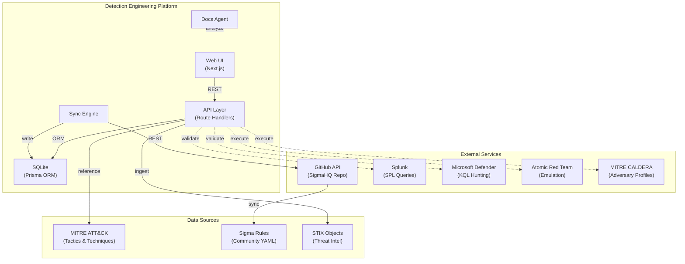
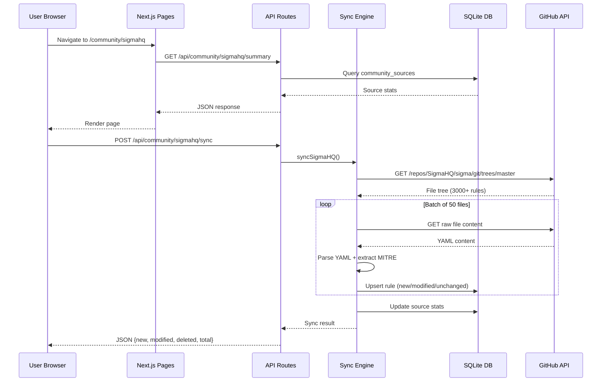
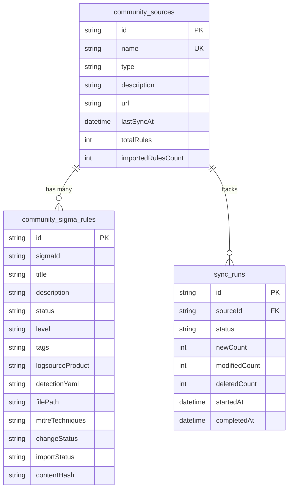

# Service Connectivity Map

> Auto-generated by docs-agent on 3/29/2026, 6:04:32 AM

## External Integrations

```mermaid
graph TB
    subgraph Platform["Detection Engineering Platform"]
        Web["Web UI<br/>(Next.js)"]
        API["API Layer<br/>(Route Handlers)"]
        DB["SQLite<br/>(Prisma ORM)"]
        Sync["Sync Engine"]
        Agent["Docs Agent"]
    end

    subgraph External["External Services"]
        GH["GitHub API<br/>(SigmaHQ Repo)"]
        Splunk["Splunk<br/>(SPL Queries)"]
        MDE["Microsoft Defender<br/>(KQL Hunting)"]
        ART["Atomic Red Team<br/>(Emulation)"]
        CALDERA["MITRE CALDERA<br/>(Adversary Profiles)"]
    end

    subgraph Data["Data Sources"]
        MITRE["MITRE ATT&CK<br/>(Tactics & Techniques)"]
        Sigma["Sigma Rules<br/>(Community YAML)"]
        STIX["STIX Objects<br/>(Threat Intel)"]
    end

    Web -->|"REST"| API
    API -->|"ORM"| DB
    Sync -->|"REST"| GH
    Sync -->|"write"| DB
    API -.->|"validate"| Splunk
    API -.->|"validate"| MDE
    API -.->|"execute"| ART
    API -.->|"execute"| CALDERA
    API -->|"reference"| MITRE
    GH -->|"sync"| Sigma
    API -->|"ingest"| STIX
    Agent -.->|"analyze"| Platform
```

## Internal Service Communication

```mermaid
sequenceDiagram
    participant U as User Browser
    participant P as Next.js Pages
    participant A as API Routes
    participant S as Sync Engine
    participant D as SQLite DB
    participant G as GitHub API

    U->>P: Navigate to /community/sigmahq
    P->>A: GET /api/community/sigmahq/summary
    A->>D: Query community_sources
    D-->>A: Source stats
    A-->>P: JSON response
    P-->>U: Render page

    U->>A: POST /api/community/sigmahq/sync
    A->>S: syncSigmaHQ()
    S->>G: GET /repos/SigmaHQ/sigma/git/trees/master
    G-->>S: File tree (3000+ rules)
    loop Batch of 50 files
        S->>G: GET raw file content
        G-->>S: YAML content
        S->>S: Parse YAML + extract MITRE
        S->>D: Upsert rule (new/modified/unchanged)
    end
    S->>D: Update source stats
    S-->>A: Sync result
    A-->>U: JSON {new, modified, deleted, total}
```

## Database Schema

```mermaid
erDiagram
    community_sources {
        string id PK
        string name UK
        string type
        string description
        string url
        datetime lastSyncAt
        int totalRules
        int importedRulesCount
    }
    community_sigma_rules {
        string id PK
        string sigmaId
        string title
        string description
        string status
        string level
        string tags
        string logsourceProduct
        string detectionYaml
        string filePath
        string mitreTechniques
        string changeStatus
        string importStatus
        string contentHash
    }
    sync_runs {
        string id PK
        string sourceId FK
        string status
        int newCount
        int modifiedCount
        int deletedCount
        datetime startedAt
        datetime completedAt
    }
    community_sources ||--o{ community_sigma_rules : "has many"
    community_sources ||--o{ sync_runs : "tracks"
```
